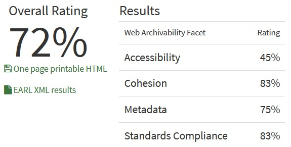

# Архив сайта Школы №1502

[`Ссылка на гугл-папку с архивом`](https://drive.google.com/drive/folders/1fWMSW3FzbUshBMH7IlPopHhdhm4r4leP?usp=drive_link)

## wpull

В данном случае выполнение алгоритма заняло примерно полчаса. 

Сайт во многом архивировался. *Примечательно, что б**о**льшую часть архива составляют киберспортивные разделы сайта.* Но `.warc.gz` файл открывается странно, хоть и сохранились многие страницы, фотографии, учебные материалы. Видимо, в силу сравнительно нового, не консерватвного движка сайта, многие функции не воспроизводятся в архиве корректно.

## ArchiveReady

Результат анализа `ArchiveReady` не в полной мере соответсвует итогу применения `wpull`, представляется, что **72%** на `ArchiveReady` не в полной мере отражают результат применения `wpull` из-за сложности сайта.

## metawarc

Анализ метаданных осуществленный metawarc дал такой результат:

`1502.moscow.warc.gz`
`Processed 10000 records`
<pre>
mimes                            files       size          share
-----------------------------  -------  ---------  -------------
image/jpeg                        3004  605955154   72.1895
application/pdf                    288  135135666   16.0992
text/html                         2294   60674140    7.22831
audio/mpeg                           2   16041802    1.91111
application/json                  3391    7940640    0.945995
image/png                           28    3544656    0.422287
application/zip                      1    2786509    0.331966
image/svg+xml                        4    2099591    0.250131
text/xml                           481    1629218    0.194094
application/rss+xml                469    1126257    0.134175
text/css                            14     629241    0.0749636
application/vnd.ms-fontobject        5     484634    0.0577361
application/font-sfnt                4     483610    0.0576141
application/javascript              17     413304    0.0492383
application/font-woff                4     274343    0.0326834
                                     3     168851    0.0201158
application/xml                      6       6491    0.000773295
text/plain                           4       1376    0.000163927
#total                           10019  839395483  100
</pre>

При выполнении metawarc `analyze sch57.ru.warc.gz` алгоритм обрабатывал лишь 10000 файлов `Processed 10000 records` . При повторении результат не изменялся. В данной выборке из 10019 проанализированных файлов почти 3/4 занимают избражения и всего 16% `.pdf`. Большое количество `.html` в данной выборке не занимает большую часть архива. *Примечательно, большое количество `.json`, а также `.xml`, которые, однако, занимают меньше 1%. Также примечательны 3 файла, которым metawarc не смог атрибутировать mime.*

в [`json-файле`](./1502.moscow_meta.jsonl) сохранилось 289 строк метаданных, все они относятся к `.pdf`. *Примечательно, что metawarc в анализе отобразил 288 файлов `application/pdf`, а еще 1 `.pdf` из `.json`-файла он распознал как `text/html`.*
