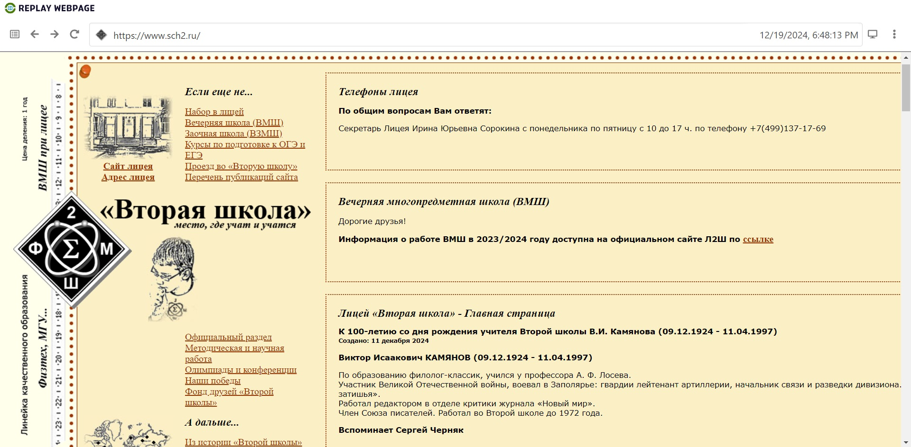
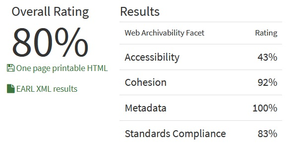

# Архив сайта Лицея "Вторая Школа"

[`Ссылка на гугл-папку с архивом`](https://drive.google.com/drive/folders/1z4lhP0ui4xWIlmJN4UXVdWgOiPV26tOm?usp=drive_link)

## wpull

В данном случае выполнение алгоритма заняло немногим менее 10 минут. 

Сайт в значительной степени архивировался, `.warc.gz` файл открывается без труда, сохранились страницы, фотографии, учебные материалы.

## ArchiveReady

Результат анализа `ArchiveReady` подтверждает итог применения `wpull`, сайт очень хорошо заархивировался, **80%** на `ArchiveReady` это подтверждают.

## metawarc

Анализ метаданных осуществленный metawarc дал такой результат:

`metawarc sch2.ru.warc.gz`
`mimes                                                                files      size          share`
`-----------------------------------------------------------------  -------  --------  -------------`
`text/html                                                             5158  58371477   59.0488`
`application/pdf                                                         38  32583736   32.9618`
`audio/mpeg                                                               1   4398316    4.44935`
`application/msword                                                      14    800646    0.809937`
`application/javascript                                                  19    733474    0.741985`
`image/jpeg                                                              17    635293    0.642665`
`text/xml                                                                 1    416111    0.42094`
`text/css                                                                 4    221483    0.224053`
`image/png                                                               20    175699    0.177738`
`image/gif                                                               31    173834    0.175851`
`image/svg+xml                                                            2    128059    0.129545`
`application/vnd.openxmlformats-officedocument.spreadsheetml.sheet        1     89417    0.0904546`
`application/vnd.ms-fontobject                                            2     41788    0.0422729`
`font/ttf                                                                 2     41418    0.0418986`
`font/woff                                                                2     36656    0.0370814`
`image/x-icon                                                             2      3647    0.00368932`
`text/plain                                                               1      1182    0.00119572`
`application/json                                                         1       654    0.000661589`
`#total                                                                5316  98852890  100`

В данном случае лишь треть архива занимают `.pdf`-файлы, что тем не менее очень немало, ведь в количественном соотношении их менее 1%. В остальном подавляющая часть сожержимого архива представлена `.html`, остальное в пределах погрешности. *Примечательно наличие аудиофайла `.mpeg`.*

в [`json-файле`](./sch2.ru_meta.jsonl) сохранилось 40 строк метаданных, все они относятся к `.pdf`. *Примечательно, что metawarc в анализе отобразил 38 файлов `application/pdf`, а еще 2 `.pdf` из `.json`-файла он распознал как `text/html`.*
