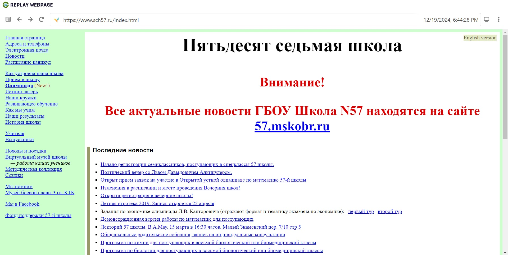
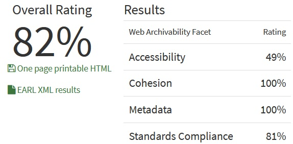

# Архив сайта Школы №57

[`Ссылка на гугл-папку с архивом`](https://drive.google.com/drive/folders/1r4sfEoNZRGkM6Y0vkno4q-pfMwKIEAgq?usp=drive_link)

## wpull

В данном случае выполнение алгоритма заняло примерно 15 минут. 

Сайт в значительной степени архивировался, `.warc.gz` файл открывается без труда, сохранились страницы, фотографии, учебные материалы.

## ArchiveReady

Результат анализа `ArchiveReady` подтверждает итог применения `wpull`, сайт очень хорошо заархивировался, **82%** на `ArchiveReady` это подтверждают.

## metawarc

Анализ метаданных осуществленный metawarc дал такой результат:

`metawarc sch57.ru.warc.gz`
`mimes                                                                files       size          share`
`-----------------------------------------------------------------  -------  ---------  -------------`
`application/pdf                                                        374  272123496   73.0852`
`image/jpeg                                                             706   90979554   24.4347`
`text/html                                                              617    7108660    1.9092`
`application/zip                                                          5     835275    0.224333`
`image/gif                                                               43     334343    0.0897957`
`application/msword                                                       6     267251    0.0717765`
`image/png                                                               16     252291    0.0677587`
`application/rtf                                                          3     123278    0.0331092`
`application/javascript                                                   6     117433    0.0315394`
`application/vnd.ms-powerpoint                                            1      97119    0.0260836`
`application/vnd.openxmlformats-officedocument.spreadsheetml.sheet        1      53494    0.0143671`
`text/css                                                                 8      26751    0.00718461`
`image/vnd.microsoft.icon                                                 1      15751    0.0042303`
`application/xml                                                          1       2334    0.000626851`
`text/plain                                                               1        481    0.000129184`
`#total                                                                1789  372337511  100`

Почти 3/4 архива занимают `.pdf`-файлы, что неудивительно, б**о**льшая часть из них — учебные материалы. оставшаяся четверть — изображения, преимущественно учащихся и педагогов, также немало `.html`, остальное в пределах погрешности.

в [`.json-файле`](./sch57.ru_meta.jsonl) сохранилось 378 строк метаданных, из которых все относятся к `.pdf`. *Примечательно, что metawarc в анализе отобразил 374 файла `application/pdf`, а еще 4 `.pdf` из `.json`-файла он распознал как `text/html`.*

